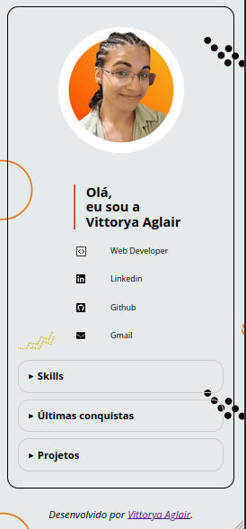

## Projeto Final: 💻

#### Detalhes:
- Foi desenvolvido um portfólio com HTML, CSS e JavaScript.
- Foi adicionado animação de slider na aba de 'Últimas conquistas'.
- Está responsivo para desktop e mobile.
- Foi aplicado boas práticas, acompanhado com a extensão WAVE, para acessibilidade. 

### Demo:

  

 Veja no ar: <a href="https://vittorya-aglair.netlify.app/" target="_blank">Demo</a>

  
  
  

#### Créditos
  <li><a href="https://fonts.google.com/">Google Fonts</a></li>
  <li><a href="https://bgjar.com/">Background</a></li>
  <li><a href="https://www.flaticon.com/br/">Icons-Skills</a></li>
  <li><a href="https://storyset.com/">Ilustração-Projetos</a></li>
  <li><a href="https://fontawesomeicons.com/svg/icons/">Icons-redes</a></li>

  

  
