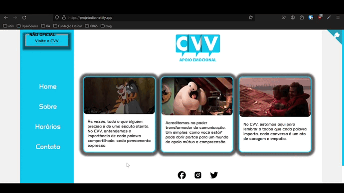

## Desafio de Projeto: 

  Estou participando do bootcamp Formação HTML Web Developer e aceitei o desafio de projeto com o tema: Saúde.   
  Inspirada pelo impactante trabalho realizado pelo CVV, busquei expressar minha visão pessoal nesta página, com todo o crédito direcionado à página oficial da organização.

Detalhes:
- Scroll Personalizado;
- Personalização de textos: realizei a formatação de textos com negrito, variações de fontes e links com a propriedade "target_blank", permitindo que os usuários acessem conteúdos externos em uma nova aba, mantendo a página principal aberta;
- Interatividade com o mouse: adicionei elementos interativos que respondem de forma dinâmica ao movimento do mouse;
- Integração de conteúdo externo com iframe;
- Tabela com efeito visual dinâmico;
- Responsividade para diferentes dispositivos.

### Demo:

  

 Veja no ar: <a href="https://projetodio.netlify.app/">Demo</a>

  
  

