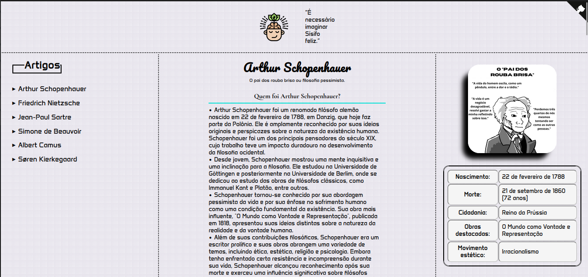

## Desafio de Projeto 

Para finalizar o bootcamp, foi proposto esse desafio de projeto visando construir uma página de artigos, com tema de nossa escolha. Decidi falar sobre filosofia. 

Demo:

  

<a href="https://osroubabrisa.netlify.app/">Veja no ar</a>

Créditos:

- Icons/logotipo: <a href="https://www.flaticon.com/br/">Flaticon</a>  
- <a href="https://tholman.com/github-corners/">GitHub Corners</a>
- Pesquisa: <a href="https://pt.wikipedia.org/wiki/Arthur_Schopenhauer">Wikipedia</a>

