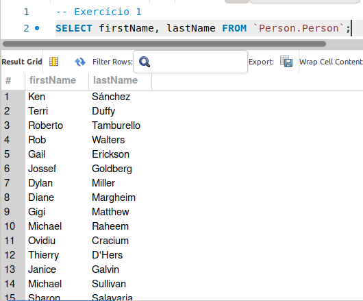
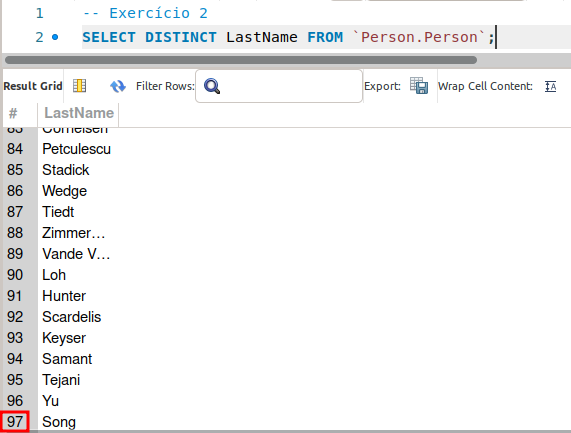
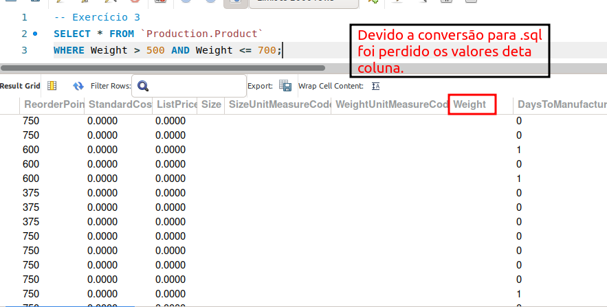
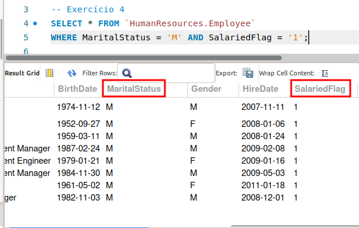
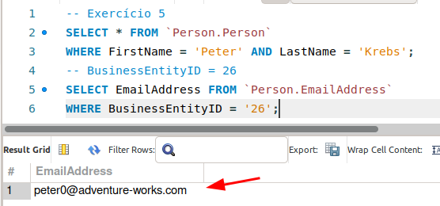

### ATV1

> A Equipe de marketing precisa fazer uma pesquisa sobre nomes comuns de seus clientes e precisa do nome e sobrenome de todos os clientes que estão cadastrados no sistema.

---

### ATV2

> Quantos nomes únicos nós temos na tabela Person.Person?

### ATV3 

> A equipe de produção de produtos precisa do nome de todas as peças que pesam mais que 500kg mas não mais que 700kg para inspeção.

### ATV4

> Foi pedido pelo marketing uma relação de todos os empregados (employees) que são casados (single=solteiro, married=casado) e são assalariados (salaried).

## ATV5

> Um usuário chamado Peter Krebs está devendo um pagamento, consiga o email dele para que possamos enviar uma cobrança! (Você deve usar a tabela person.person e depois a tabela person.emailaddress).

